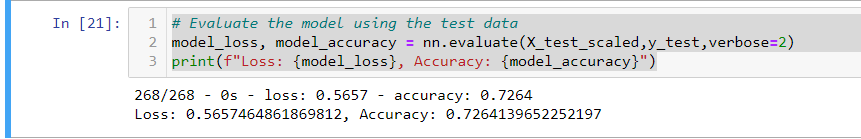
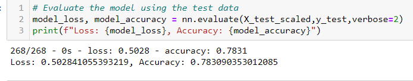

# Neural Network Charity Analysis

## Analysis Overview
To create a binary classifier to predict whether applicants will be successful if they were to receive money from Alphabet Soup a non-profit philanthropic foundation. 

## Data processing 
The charity_data.csv contains more then 34,000 organizations that have received funding from Alphabet Soup over the years. Listed are the columns in the data set:
-  EIN and  - NAME—Identification columns
- APPLICATION_TYPE—Alphabet Soup application type
- AFFILIATION—Affiliated sector of industry
- CLASSIFICATION—Government organization classification
- USE_CASE—Use case for funding
- ORGANIZATION—Organization type
- STATUS—Active status
- INCOME_AMT—Income classification
- SPECIAL_CONSIDERATIONS—Special consideration for application
- ASK_AMT—Funding amount requested
- IS_SUCCESSFUL—Was the money used effectively

#### What variable(s) are considered the target(s) for your model?
IS_SUCCESSFUL 

#### What variable(s) are considered to be the features for your model?
APPLICATION_TYPE',
 'AFFILIATION',
 'CLASSIFICATION',
 'USE_CASE',
 'ORGANIZATION',
 'INCOME_AMT',
 'SPECIAL_CONSIDERATIONS'

#### What variable(s) are neither targets nor features, and should be removed from the input data?
"EIN", "NAME"

Compiling, Training, and Evaluating the Model
### How many neurons, layers, and activation functions did you select for your neural network model, and why?
1st and 2nd layers with "relu" activation, outer layer with "sigmoid" activation.  60 neurons in first hidden layer, 40 neurons in the second layer 
### Were you able to achieve the target model performance?
No

2nd attempt
#### What variable(s) are considered the target(s) for your model?
IS_SUCCESSFUL 
#### What variable(s) are neither targets nor features, and should be removed from the input data?
"EIN"
#### What variable(s) are considered to be the features for your model?
'NAME',
 'APPLICATION_TYPE',
 'AFFILIATION',
 'CLASSIFICATION',
 'USE_CASE',
 'ORGANIZATION',
 'INCOME_AMT',
 'SPECIAL_CONSIDERATIONS'
 
 ### How many neurons, layers, and activation functions did you select for your neural network model, and why?
 1st layer "relu" activation and 100 neurons, 2nd layer "relu" activation and 30 neurons, 3rd layer "relu" activation and 30 neurons
 
 ### Were you able to achieve the target model performance?
 Yes
 
 
 

### Summary
The 2nd attempt reached the 78% accuracy, which is what we wanted.  Changing anything else with the model could make it overfit and not be able to reach the desired outcome.   
